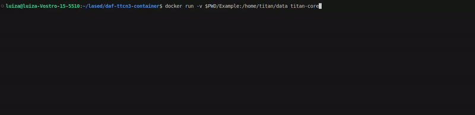

# Titan Core Image <!-- omit in toc -->

**Summary**
- [Introduction](#introduction)
- [How to use this image](#how-to-use-this-image)
- [Sample Test Cases](#sample-test-cases)
- [References](#references)

## Introduction

This repository provides a pre-configured image of [Titan Core version 10.1.2](https://gitlab.eclipse.org/eclipse/titan/titan.core/-/tree/10.1.2?ref_type=tags), optimized to ensure the seamless integration and operation of the `TTCN-3` execution environment within a Docker container. This setup facilitates the execution and generation of `TTCN-3` binaries independently of the `Eclipse IDE`, simplifying the modeling and development of TTCN-3 test cases. Additionally, the image is designed for easy customization and adaptation for diverse project requirements. 

> [!NOTE]
> This image was based on the [Dockerfile of Titan Core](https://gitlab.eclipse.org/eclipse/titan/titan.core/-/tree/10.1.2/docker?ref_type=tags) with the following functionalities added:
> - Upgrade of the operating system version to `Ubuntu 22.04`
> - Entrypoint to compile TTCN-3 test cases located in the working directory

[TTCN-3 (Testing and Test Control Notation Version 3)](http://www.ttcn-3.org) is a standardized language for defining and specifying test scenarios, providing a formal framework for creating comprehensive and repeatable test processes. Titan Core is an open-source TTCN-3 test execution environment that enables execution and management of TTCN-3 tests. Typically, working with TTCN-3 requires the installation of the __Eclipse IDE__ and associated plugins. This image, however, eliminates the need for such, enabling direct execution and management of TTCN-3 tests within your chosen development environment.


## How to use this image 

1. **Prepare Your Test Cases**
   
    This repository contains TTCN-3 test cases designed to help you get started. If you want to use this [Sample Test Cases](#sample-test-cases), you can clone the repository and navigate to the project directory with the following commands:

    ```bash
    git clone https://github.com/ifsc-lased/titan-core-image
    cd titan-core-image
    ```

    Alternatively, if you want to use your own test cases, create a directory to organize them. In our sample setup, this directory is named [`Example`](./Example/). Place your `.ttcn` file, such as `MyExample.ttcn`, along with any other project-related files inside this directory.  Your directory structure should look like ours, but with your specific test cases and configurations:

    ```bash
    Example/
        ├─ MyExample.ttcn
        ├─ MyExample.cfg 
        ├─ PCOType.cc
        ├─ PCOType.hh
    ```

2. **Build the Docker Image**

    In the directory containing the [Dockerfile](./Dockerfile) provided, build the image:

    ```bash
    docker build -t titan-core .
    ```

3. **Run the Docker Container**

    Use the Docker container to compile TTCN-3 test cases and generate the Executable Test Suite (ETS) binary. The following command maps your test case directory into the container and produces the binary file for your test cases:


    ```bash
    docker run -v $PWD/Example:/home/titan/data titan-core
    ```

    In this command:

    - `$PWD/Example` is the directory of step 1.
    - `/home/titan/data` is the destination directory within the Docker container where your local test cases file will be accessible.
  
4. **Execute the Generated Binary**
   
    After compilation, execute the ETS binary. Running this binary will execute your TTCN-3 test cases and generate the test results. 

    ```bash
    Example/bin/ets.bin
    ```

    In this command:

    - `Example/` is the directory of step 1.


## Sample Test Cases

The [`Example`](./Example/) directory in this repository contains two TTCN-3 test cases, each accompanied by a description detailing what each test does. This example is designed to help you become familiar with using this image.

To give you a clearer understanding of the execution process, a demonstration is available below:



To try these test cases on your own machine or to execute your own, follow the guide in the [How to use this image](#how-to-use-this-image) section.


## References

- http://www.ttcn-3.org
- https://projects.eclipse.org/projects/tools.titan
- https://gitlab.eclipse.org/eclipse/titan/titan.core
